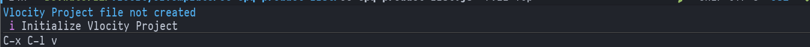
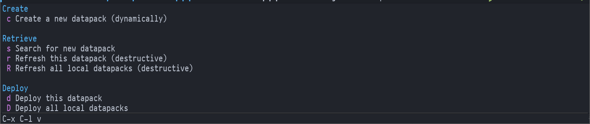

# vlocitemacs
Emacs transient wrapper for the Vlocity Build Tool

## Install

### via Doom Emacs
```elisp
;; in package.el
(package! vlocitemacs
  :recipe (:host github
           :repo "leothelocust/vlocitemacs"
           :files ("*.el")))
           
;; in config.el
(use-package! vlocitemacs
    :commands vlo/transient-action
    :bind ("C-x C-l v" . #'vlo/transient-action))
```
### via use-package & straight
```elisp
(use-package vlocitemacs
  :straight (
             :type git
             :host github
             :repo "leothelocust/vlocitemacs"
             :branch "main")
  :commands vlo/transient-action
  :bind ("C-x C-l v" . vlo/transient-action))
```

## Screenshots



After initializing you'll get this:


